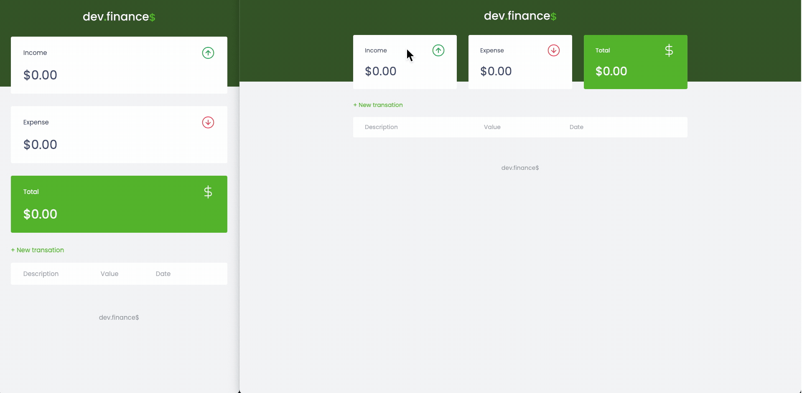

<h1 align="center">
    
</h1>

<h5 align="center">
  <b>Final code Rocketseat's Discover Marathon</b> 👨‍🏫
</h5>

## :computer: About the project

This project was developed during Rocketseat's Discover Marathon.

## :floppy_disk: Executing the project

##### 1. You need to clone the repository.
    $ git clone https://github.com/gitpcl/dev-finance.git

## 💻 Setting up your enviroment:

- [Visual Studio Code](https://code.visualstudio.com/)

## 👨‍💻 Front-End Technologies used:

- [HTML](https://devdocs.io/html/)
- [CSS](https://devdocs.io/css/)
- [Javascript](https://devdocs.io/javascript/)

## :memo: License

This project is under an MIT license. Please check the [LICENSE](LICENSE.md) for more information.

---

Made 💜  by [Pedro Lopes](https://www.pedroclopes.com)